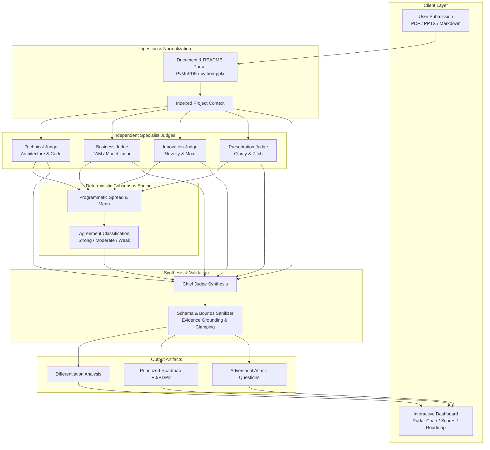
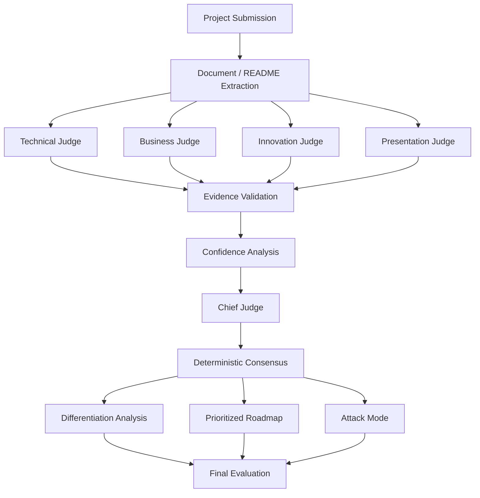

# IdeaValidator-AI

> Evidence-grounded multi-agent evaluation platform for analyzing software projects, startup ideas, and pitch submissions.

[](backend/)
[](backend/main.py)
[](frontend/)
[](backend/test_reliability.py)
[](LICENSE)

Technical Evaluation • Business Evaluation • Innovation Analysis • Presentation Review  
Evidence Grounding • Confidence • Consensus • Attack Mode • Differentiation • Roadmap

---

## Project Preview

> **Manual Screenshot Setup:** The repository does not store pre-generated binaries to maintain a lightweight footprint. To capture screenshots from a local run, start the services (`uvicorn main:app` and `npm run dev`) and save captures to `docs/images/`.

Recommended documentation captures:

| Priority | Target Surface | Recommended Path | Visual Focus & Captions |
|:---:|---|---|---|
| 1 | **Final Verdict** | `docs/images/01_final_verdict.png` | Chief Judge verdict banner, overall calibrated score (0–10), and dimension breakdown radar chart. |
| 2 | **Evidence Findings** | `docs/images/02_evidence_findings.png` | Specialist judge cards showing typed evidence tags (`project`, `uploaded_document`, `inference`) and confidence metrics. |
| 3 | **Judge Consensus** | `docs/images/03_judge_consensus.png` | Programmatic agreement indicator (`strong`, `moderate`, `weak`), score spread, and alignment metrics. |
| 4 | **Differentiation Analysis** | `docs/images/04_differentiation.png` | Categorization, verified strengths, competitive gaps, and flagged unsupported claims. |
| 5 | **Prioritized Roadmap** | `docs/images/05_prioritized_roadmap.png` | Engineering action items categorized into P0 (critical), P1 (high), and P2 (enhancement) with impact/effort. |
| 6 | **Attack Mode** | `docs/images/06_attack_mode.png` | Adversarial cross-examination questions challenging unit economics, scalability, and defensibility. |

---

## Why IdeaValidator-AI?

### Traditional Single-Prompt LLM Evaluation
```
"Send a project description to an LLM and ask for a score."
```
- **Monolithic Bias:** A single prompt conflates presentation polish with technical viability.
- **Unverified Hallucinations:** Claims are accepted at face value or critiqued against fabricated details.
- **Opaque Scoring:** Returns a subjective score with no variance bounds or agreement metrics.
- **Generic Feedback:** High-level advice ("improve marketing", "add tests") without engineering prioritization.

### IdeaValidator-AI Approach
- **Independent Specialist Judges:** Dedicated evaluator agents analyze Technical Architecture, Business Viability, Innovation, and Presentation in strict isolation.
- **Evidence-Grounded Findings:** Every observation is tied to source citations with explicit evidence typing (`project`, `uploaded_document`, `external`, `inference`, `not_verified`).
- **Confidence Estimates:** Calibrated confidence (0–100%) and evidence quality indicators reflect input completeness.
- **Deterministic Consensus Analysis:** Python calculates score spread, mean, most aligned judge, and panel outlier algorithmically—zero LLM hallucination in statistical metrics.
- **Chief Judge Synthesis:** Structured harmonization of independent agent reports into a holistic verdict.
- **Differentiation Analysis:** Systematically contrasts claims against verifiable features and highlights unsupported claims.
- **Adversarial Questions (Attack Mode):** Simulates VC and senior judge stress-testing on defensibility and edge cases.
- **Prioritized Improvement Roadmap:** Action items categorized into P0 (critical), P1 (high), and P2 (enhancement) with impact and effort ratings.

---

## 1. Overview

**IdeaValidator-AI** is an evidence-grounded multi-agent evaluation platform designed to assess software projects, hackathon submissions, and early-stage startup ideas. Rather than reducing project appraisal to a single opaque score, the system orchestrates independent specialist agents across distinct evaluation domains, extracts verifiable evidence from project artifacts, and calculates deterministic consensus metrics to provide structured, traceable, and actionable feedback.

The system processes project artifacts—including Markdown documentation (`README.md`), pitch decks (PDF), and presentation slide decks (PPTX)—without persistent data retention.

---

## 2. Problem

Evaluating technical projects and startup pitches presents recurring systemic challenges:

- **Subjectivity & Inconsistent Rubrics:** Human panels often apply varying evaluation criteria across technical depth, business feasibility, and design polish.
- **Superficial Feedback:** Standard feedback frequently lacks actionable root-cause analysis, leaving builders without clear paths for remediation.
- **Evaluation Halo Effects:** High presentation quality frequently masks underlying architectural or business model deficiencies, while complex engineering can mask the absence of market demand.
- **Hallucinated or Unsubstantiated Critique:** Generic AI evaluators routinely fabricate details not present in the source documentation, penalizing or rewarding projects based on invented premises.

---

## 3. Solution

IdeaValidator-AI resolves these issues through an evidence-grounded multi-agent architecture:

- **Domain Separation:** Four specialized evaluator agents analyze the submission concurrently across isolated dimensions (Technical, Business, Innovation, Presentation) using targeted rubrics.
- **Strict Evidence Grounding:** All claims and findings are attributed to verifiable references in submitted files, classified by evidence type (`project`, `uploaded_document`, `inference`, `not_verified`).
- **Deterministic Consensus Engine:** Judge agreement, disagreement, and score spread are computed algorithmically in Python rather than generated via probabilistic LLM text.
- **Adversarial Interrogation (Attack Mode):** Optional adversarial critique exposes hidden assumptions, architectural vulnerabilities, and unvalidated market hypotheses.
- **Prioritized Action Plan:** Synthesizes findings into structured P0, P1, and P2 remediation roadmaps with concrete effort and impact ratings.

> **Positioning:** IdeaValidator-AI is an evidence-grounded multi-agent evaluation system that analyzes a project from multiple independent dimensions and produces traceable findings, confidence estimates, consensus analysis, adversarial questions, and prioritized improvements.

---

## 4. Key Features

- **Four Specialist Evaluator Agents:** Independent analysis across Technical Architecture, Business Viability, Innovation/Uniqueness, and Presentation/Clarity.
- **Chief Judge Synthesis:** Consolidates multi-agent reports into a cohesive assessment, overall score (0–10), and executive summary.
- **Programmatic Consensus Calculation:** Computes score spread, mean, standard deviation indicators, most aligned judge, and outlier judge without model hallucination.
- **Evidence Verification & Typing:** Explicit tagging of findings with confidence levels (0–100%) and evidence quality indicators.
- **Differentiation & Competitor Gap Analysis:** Explicitly contrasts claimed differentiators against documented capabilities while flagging unsupported assertions.
- **Prioritized Roadmap:** Action items categorized by severity (`P0` critical, `P1` important, `P2` enhancement) with impact and effort matrices.
- **Judge Attack Mode:** High-pressure adversarial questioning simulating tough venture capital partner or hackathon judge Q&A.
- **Interactive Visualization & Export:** Radar charts displaying dimension coverage, score breakdowns, and single-click Markdown summary report export.
- **Privacy by Design:** Zero persistence architecture; uploaded artifacts are processed in transient memory or temporary system directories and immediately unlinked after execution.

---

## 5. How It Works

1. **Submission:** The user provides project artifacts via the web interface: a pitch deck (`.pdf`, `.pptx`) and/or documentation (`.md`).
2. **Extraction & Context Assembly:** The backend extracts text streams using PyMuPDF and python-pptx, strips non-text overhead, and normalizes the text into an indexed project context.
3. **Parallel Specialist Evaluation:** Four independent judge agents evaluate the unified context concurrently via asynchronous API calls.
4. **Deterministic Consensus Calculation:** Python routines compute agreement metrics, score spreads, and statistical alignment across judge outputs.
5. **Chief Judge Synthesis:** The Chief Judge aggregates specialist outputs, consensus indicators, and source context to produce the overall verdict, differentiation analysis, prioritized roadmap, and defense questions.
6. **Output Validation & Sanitization:** All outputs pass through strict validation boundaries—clamping numerical scores, validating schemas, sanitizing string inputs against injection attacks, and enforcing fallback defaults.
7. **Client Presentation:** The frontend renders radar charts, score cards, evidence tags, consensus metrics, and provides an exportable evaluation report.

---

## 6. Architecture



---

## 7. Evaluation Pipeline

The evaluation pipeline follows a deterministic multi-stage execution model:



### Sanitization & Safety Layer
To ensure system stability, every raw model output passes through verification routines:
- **`_clamp_int(val, lo, hi, default)`**: Ensures scores, confidence levels, and evidence metrics never exceed valid boundaries `[0, 10]` or `[0, 100]`.
- **`_sanitize_string_list(items, max_items, max_length)`**: Truncates strings, caps array sizes, and strips potential injection markers or prompt-echo artifacts.
- **`_validate_finding(dict)`**: Ensures all key findings include attributed sources and valid evidence categories.
- **`_validate_chief_result(dict)`**: Verifies schema integrity for roadmaps, differentiation objects, and attack mode questions, providing fallbacks if any fields are omitted.

---

## 8. Evidence Grounding

To mitigate artificial intelligence hallucinations, IdeaValidator-AI grounds evaluator outputs directly in submitted source artifacts.

Judges must categorize each finding into an established evidence type:
- **`project`**: Directly observed in the project's source code, README, or configuration.
- **`uploaded_document`**: Explicitly cited from the submitted pitch deck or presentation slides.
- **`external`**: Recognized industry benchmark or platform constraint.
- **`inference`**: Logical deduction derived from stated architecture or parameters.
- **`not_verified`**: Unsubstantiated assertion or speculative claim requiring further validation.

Each finding carries an independent confidence score (0–100%) and an exact reference indicating where the premise was derived.

---

## 9. Confidence & Consensus

### Algorithmic Consensus
Consensus is calculated purely in code using standard statistical measures, ensuring deterministic reproducibility:

$$\text{Mean} = \frac{1}{N} \sum_{i=1}^{N} S_i, \quad \text{Spread} = \max(S) - \min(S)$$

- **Strong Agreement:** $\text{Spread} \le 2$ points across all four judges.
- **Moderate Agreement:** $2 < \text{Spread} \le 4$ points.
- **Weak Agreement (Split Panel):** $\text{Spread} > 4$ points.

The system programmatically identifies the **Most Aligned Judge** (smallest deviation from mean) and the **Largest Disagreement** (furthest outlier).

### Confidence Calibration
Each evaluator reports a confidence metric ($0\text{--}100$) reflecting data completeness. When an evaluation receives minimal or vague inputs, confidence metrics drop accordingly, preventing unearned high ratings.

---

## 10. Attack Mode

When **Judge Attack Mode** is enabled, the prompt context switches from constructive mentorship to adversarial due diligence:

- **Stress-Testing Assumptions:** Identifies unaddressed attack vectors, scalability bottlenecks, single points of failure, and ambiguous unit economics.
- **Challenging Market Claims:** Interrogates claims of "no competitors," defensibility moats, and unvalidated customer acquisition loops.
- **Targeted Defense Questions:** Generates 6 precise, high-pressure questions designed to test the founding team's domain grasp during live judging or pitch presentations.

---

## 11. Differentiation Analysis

The Chief Judge performs a focused differentiation assessment structured as follows:

- **Solution Category:** Standard classification of the application space.
- **Claimed Differentiators:** Key value propositions identified in the submission.
- **Differentiation Strengths:** Tangible technical or business advantages verified in the materials.
- **Differentiation Gaps:** Unaddressed competitive threats, missing features standard in the category, or commodity layers.
- **Unsupported Claims:** Specific claims (e.g., performance metrics, user counts, patent claims) lacking supporting evidence in the provided materials.
- **Limitation Notice:** Explicit disclaimer noting that differentiation findings are based strictly on submitted files without external web scraping.

---

## 12. Prioritized Roadmap

Improvements are prioritized into an engineering-style matrix:

| Priority | Level | Description |
|---|---|---|
| **P0** | Critical | Fundamental blockers affecting core viability, security, or primary functionality. |
| **P1** | High | Key architectural improvements, validation steps, or essential competitive parity. |
| **P2** | Enhancement | Polish, secondary optimizations, long-term feature expansion, or documentation styling. |

Each item is structured with:
- **Title:** Action-oriented milestone description.
- **Reason:** Root cause justifying the prioritization.
- **Impact:** `High`, `Medium`, or `Low`.
- **Effort:** `High`, `Medium`, or `Low`.

---

## 13. Evaluation Reliability

The platform undergoes rigorous automated reliability testing and validation across controlled test suites (`test_eval_pipeline.py`, `test_reliability.py`, `test_security.py`) and real-world project artifacts.

| Test | Result |
|---|---|
| Automated reliability tests | 7/7 passed |
| Real project evaluation | Passed |
| Technical/business separation | Passed |
| Incomplete project handling | Passed |
| Evidence hallucination audit | 0 fabricated claims detected |
| Score stability | Passed |
| Deterministic consensus | Passed |
| Differentiation safety | Passed |
| Backend tests | Passed |
| Frontend build | Passed |
| API compatibility | Passed |
| Markdown export | Passed |

> **Disclaimer:** These tests evaluate system behavior and reliability characteristics on controlled and representative inputs. They do not establish objective ground-truth accuracy across all possible projects.

---

## 14. Technology Stack

### Backend
- **Framework:** Python 3.10+, FastAPI 0.111.0, Uvicorn
- **AI Integration:** Google Generative AI Python SDK (`google-generativeai` 0.7.2 / Gemini Pro Flash)
- **Document Parsers:** PyMuPDF (`fitz` 1.24.3) for PDF parsing, `python-pptx` (0.6.23) for presentation decks
- **File & Stream Handling:** `aiofiles`, `python-multipart`
- **Configuration:** `python-dotenv`

### Frontend
- **Framework:** React 18.3.1, Vite 5.3.4
- **Styling:** Tailwind CSS 3.4.4, PostCSS, Autoprefixer
- **UI Components:** Custom SVG radar visualization, dynamic scorecards, accessible modals, responsive layouts

---

## 15. Project Structure

```
hackathon-judge-ai/
├── README.md                           # Project documentation
├── backend/
│   ├── main.py                         # FastAPI server, endpoints, rate limiting, security headers
│   ├── judges.py                       # Specialist & Chief judge orchestration, consensus engine
│   ├── prompts.py                      # Dimension-specific evaluation rubrics & system prompts
│   ├── file_parser.py                  # PDF, PPTX, and Markdown extraction and cleaning
│   ├── gemini_service.py               # Gemini API client, retries, and error handling
│   ├── utils.py                        # Path utilities and secure file cleanup helpers
│   ├── requirements.txt                # Python dependencies
│   ├── test_reliability.py             # 7-test reliability and consensus validation suite
│   ├── test_eval_pipeline.py           # Sanitization, clamping, and schema validation tests
│   ├── test_security.py                # Security, rate limiting, and input sanitization tests
│   └── run_validation.py               # Multi-run evaluation validation and stability checks
└── frontend/
    ├── package.json                    # Node dependencies and scripts
    ├── vite.config.js                  # Vite configuration
    ├── tailwind.config.js              # Tailwind design tokens and layout extensions
    ├── index.html                      # Entry HTML document
    └── src/
        ├── main.jsx                    # React entrypoint
        ├── App.jsx                     # Core application view and state management
        ├── index.css                   # Global styles and font definitions
        └── components/
            ├── UploadZone.jsx          # Drag-and-drop file ingestion zone
            ├── ScoreCard.jsx           # Domain-specific judge breakdown cards
            ├── OverallScore.jsx        # Chief Judge verdict and score banner
            ├── RadarChart.jsx          # Dimension balance radar chart visualization
            ├── ConsensusCard.jsx       # Programmatic consensus and alignment metrics
            ├── DifferentiationCard.jsx  # Competitive differentiation and gaps analysis
            ├── JudgeQuestions.jsx      # Attack Mode interrogation questions
            └── LoadingScreen.jsx       # Staged progress indicator during evaluation
```

---

## 16. Getting Started

### Prerequisites
- **Python:** Version 3.10 or higher
- **Node.js:** Version 18.0 or higher
- **Google Gemini API Key:** From [Google AI Studio](https://aistudio.google.com/)

### 1. Backend Setup

```bash
cd backend

# Create and activate virtual environment
python -m venv .venv
# On Windows:
.venv\Scripts\activate
# On Linux/macOS:
# source .venv/bin/activate

# Install dependencies
pip install -r requirements.txt

# Configure environment variables
cp .env.example .env
# Open .env and set your GEMINI_API_KEY
```

Run the backend server:

```bash
uvicorn main:app --reload --port 8000
```

The API will be available at `http://localhost:8000`. API documentation is accessible at `http://localhost:8000/docs`.

### 2. Frontend Setup

```bash
cd frontend

# Install Node dependencies
npm install

# Start development server
npm run dev
```

The client will be accessible at `http://localhost:5173`.

### 3. Running Test Suites

Run the backend test suites from the `backend/` directory:

```bash
cd backend

# Run reliability test suite
pytest test_reliability.py -v

# Run pipeline validation suite
pytest test_eval_pipeline.py -v

# Run security test suite
pytest test_security.py -v
```

---

## 17. Example Evaluation

### API Request
```bash
curl -X POST "http://localhost:8000/evaluate" \
  -F "readme=@README.md" \
  -F "attack_mode=false"
```

### Response Schema (Truncated Sample)
```json
{
  "innovation": {
    "score": 8,
    "confidence": 85,
    "evidence_quality": 80,
    "strengths": ["Evidence-grounded verification mechanism separates verifiable facts from speculation."],
    "weaknesses": ["Relies on source text without real-time external database cross-referencing."],
    "key_findings": [
      {
        "finding": "Multi-agent evaluation separates technical and business dimensions.",
        "evidence": "Observed parallel specialist execution in backend/judges.py",
        "source": "README.md",
        "evidence_type": "project",
        "confidence": 90
      }
    ]
  },
  "technical": {
    "score": 8,
    "confidence": 90,
    "evidence_quality": 85,
    "strengths": ["FastAPI asynchronous execution with parallel judge scheduling."],
    "weaknesses": ["OCR parser not implemented for image-only presentation slides."],
    "key_findings": [ ... ]
  },
  "business": { "score": 7, "confidence": 75, "evidence_quality": 70, ... },
  "presentation": { "score": 8, "confidence": 85, "evidence_quality": 80, ... },
  "consensus": {
    "mean": 7.8,
    "min": 7,
    "max": 8,
    "spread": 1,
    "agreement_level": "strong",
    "most_aligned": "innovation",
    "largest_disagreement": "business",
    "avg_confidence": 84,
    "avg_evidence_quality": 79
  },
  "chief_judge": {
    "overall_score": 7.8,
    "final_verdict": "Well-architected evaluation platform with clear dimension separation and defensive data handling.",
    "prioritized_roadmap": [
      {
        "priority": "P0",
        "title": "Add fallback OCR extraction pipeline",
        "reason": "Image-only PDFs currently yield empty text streams.",
        "impact": "High",
        "effort": "Medium"
      }
    ],
    "differentiation": {
      "solution_category": "AI Evaluation Platform",
      "claimed_differentiators": ["Evidence-based scoring", "Deterministic consensus"],
      "differentiation_strengths": ["Programmatic consensus avoids LLM hallucination in statistical metrics."],
      "differentiation_gaps": ["No live multi-tenant benchmarking database."],
      "unsupported_claims": [],
      "limitation_note": "Analysis based solely on submitted materials without external verification."
    },
    "judge_questions": [
      "How does the system handle adversarial prompt injections embedded within submitted pitch decks?",
      "What is the operational cost per complete 5-agent evaluation run?"
    ]
  }
}
```

---

## 18. Limitations

The following validated limitations apply to the current release:

- **OCR and Non-Textual Document Limitations:** The document parser relies on extractable text layers in PDFs and shape text in PPTX files. Scanned documents or image-only pitch decks without embedded text cannot be extracted without an OCR pipeline.
- **No Automated External Market Verification:** External market claims, competitor matrices, or financial statistics are assessed against the logic of submitted materials. The system does not browse live external web databases during evaluation.
- **Natural LLM Output Variance:** While consensus calculations and schema validations are strictly deterministic, generative evaluations across underlying LLMs can display natural minor phrasing and scoring variations across runs.
- **Confidence Metric Scope:** Confidence and evidence quality scores reflect model-assessed completeness and directness of source material; they do not represent a statistical mathematical probability of factual truth.
- **Input Quality Dependency:** Evaluation precision is bounded by the detail, accuracy, and completeness of the submitted README or pitch deck. Incomplete inputs lead to lower confidence and wider variance.
- **Due Diligence Precaution:** IdeaValidator-AI is an automated analytical aid for hackathon judges, mentors, and founders. It should not be treated as a replacement for human technical due diligence, legal review, or formal investment auditing.

---

## 19. Future Improvements

Planned future iterations include:
- **Multimodal OCR & Visual Parsing:** Integrating multimodal vision models to parse infographics, UI screenshots, architectural diagrams, and image-based presentation slides.
- **External Fact & Domain Verification:** Optional search-augmented tooling to verify domain availability, public competitor offerings, and patent registries.
- **Custom Rubric Configuration:** Support for custom hackathon or accelerator evaluation matrices (e.g., custom weights for track-specific criteria).
- **Interactive Defense Simulator:** Audio or chat-based interactive Q&A allowing founders to practice live pitch defense against the Chief Judge.

---

## 20. License

This project is licensed under the [MIT License](LICENSE).
